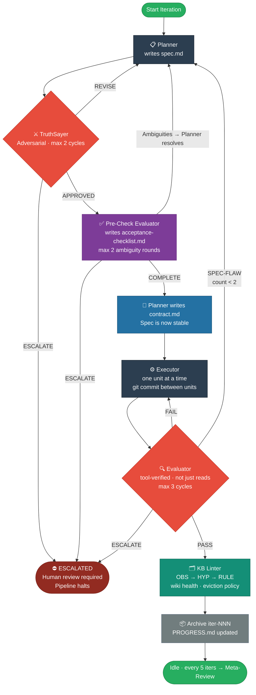
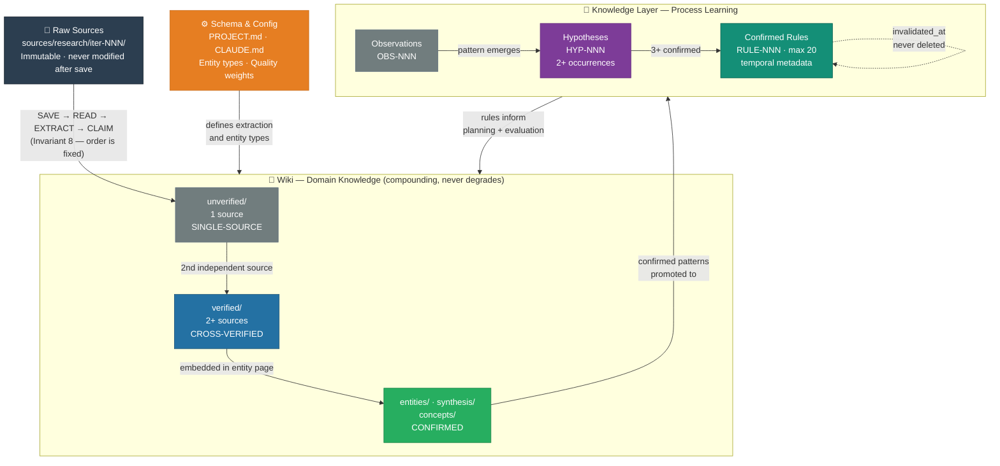

# KB-Orchestrator-Core

**A production-validated blueprint for LLM-assisted projects that don't hallucinate, drift, or forget.**

[](SYSTEM-BLUEPRINT.md)
[](https://claude.ai/code)
[](suggestions/pending.md)
[](#research-foundation)

---

## The Problem

Every LLM-assisted project hits the same wall:

| Failure mode | What it looks like |
|---|---|
| **Hallucination laundering** | Unverified claims get cited, promoted to "confirmed," and built on |
| **Sycophancy collapse** | Agents praise each other's output instead of challenging it |
| **Context amnesia** | Insight from iteration 3 is gone by iteration 8 |
| **Spec drift** | What gets built diverges from what was agreed |
| **Gap blindness** | Unverified assumptions stay invisible until they break production |
| **Fact corruption** | New facts silently overwrite old ones, no trace left |
| **Reward hacking** | Agent satisfies the evaluator's surface checks without solving the real problem |

Most teams patch these one at a time. This system eliminates all seven structurally.

---

## What This Is

**KB-Orchestrator-Core** is a canonical system blueprint for running LLM agents on real projects — research, commercial, or hybrid. It defines:

- **An adversarial pipeline** where the agent that produces output is structurally separated from the agent that evaluates it
- **A self-learning knowledge base** where observations promote to hypotheses promote to confirmed rules — compounding across every iteration
- **A wiki layer** for domain knowledge that never degrades, only gets richer
- **Temporal fact management** — facts are invalidated, never silently overwritten
- **Claude Code harness integration** — hooks, MCP servers, permission modes, slash commands

This is not a prompt template. It is an architecture.

> **Pass `SYSTEM-BLUEPRINT.md` to any agent on any project. The agent adopts applicable components based on project state, type, and scale.**

---

## Architecture

### Agent Pipeline



### Knowledge Architecture



**Three non-negotiable design principles:**

1. **Generator ≠ Evaluator** — Structural separation, not instructional. One agent cannot both produce and judge its own output.
2. **Sprint contract before execution** — The Evaluator signs acceptance criteria *before* the Executor writes a single line. Prevents non-convergence.
3. **Temporal facts, never overwrites** — Old facts are marked `invalidated_at`, not deleted. The KB is an audit trail.

---

## Who This Is For

- **AI engineers** building multi-agent systems and tired of agents that hallucinate or drift
- **Developers using Claude Code** who want a structured harness, not just prompts
- **Research teams** compiling knowledge bases that need to stay accurate over hundreds of sources
- **Commercial builders** who need LLM output they can actually ship

You don't need all of it. The [Minimum Viable Adoption](#minimum-viable-adoption) section is three elements that eliminate 80% of the failure modes.

---

## What's Included

```
KB-Orchestrator-Core/
├── SYSTEM-BLUEPRINT.md       ← The canonical reference (24 sections, ~2,500 lines)
├── CHANGELOG.md              ← Full version history with audit findings
├── CLAUDE.md                 ← How this repo operates and evolves
├── commands/
│   └── pre-check.md          ← Canonical Pre-Check Evaluator slash command
├── audits/                   ← 3 independent adversarial audit reports
├── research/sources/         ← Karpathy LLM wiki deep research + source library
└── suggestions/
    └── pending.md            ← Adoption-project suggestions tracker
```

**What the blueprint covers:**

| Section | Topic |
|---|---|
| 1–2 | Philosophy + Non-Negotiable Invariants |
| 3–5 | Architecture, Directory Structure, Config Files |
| 6–9 | Agent Roles, Pipeline Lifecycle, Slash Commands |
| 10–14 | KB Architecture (Karpathy pattern), Wiki Layer, Knowledge Layer, Temporal Facts, Provenance |
| 15–19 | Quality Criteria, Escalation, Token Budget, Reward Hacking, Trust Model |
| 20–22 | Selective Retrieval (3-tier), Meta-Review, Harness Decay |
| 23 | Adoption Guide (new and mid-project) |
| 24 | Claude Code Harness Integration (hooks, MCP, permissions, CLAUDE.md hierarchy) |

---

## Quick Start

### Option A — Drop the blueprint into an existing project

```bash
# Copy the blueprint into your project
cp SYSTEM-BLUEPRINT.md your-project/

# Generate slash commands from Section 6 + 9 role descriptions
mkdir -p your-project/.claude/commands/
cp commands/pre-check.md your-project/.claude/commands/
# Generate the remaining 11 commands (plan, audit, execute, evaluate, kb-lint, ...)
# from the role descriptions in Sections 6 and 9
```

Then pass the blueprint to Claude Code:
```
Read SYSTEM-BLUEPRINT.md and scaffold this project as a commercial project.
Project type: commercial. Primary objective: [your objective].
Run /onboard to generate the full directory structure.
```

### Option B — Fork this repo as your reference system

Fork → rename → update `CLAUDE.md` with your project's specifics → adapt blueprint sections to your domain.

---

## Minimum Viable Adoption

If full adoption isn't feasible, these three elements eliminate 80% of the failure modes:

1. **File-based iteration state** — `iterations/current/` with `spec.md` + `eval-report.md`. Prevents drift, enables review.
2. **Generator ≠ Evaluator** — Even manually: review your own spec from an adversarial lens before executing.
3. **Claim confidence tracking** — Inline citations + `unverified/` folder. Prevents hallucination laundering.

---

## Research Foundation

The blueprint synthesises validated findings from:

| Source | Contribution |
|---|---|
| **Karpathy** — LLM Wiki / Knowledge Base Architecture | Raw/+wiki/ two-layer pattern, query compounding, ~100-source scale threshold |
| **Anthropic Engineering** (March 2026) | Sprint contract pattern, live-tool evaluators as qualitative best practice, harness assumption decay |
| **Zep / Graphiti** (arXiv:2501.13956) | Bi-temporal knowledge graph, four-timestamp model |
| **Shopify Engineering** (2025) | Reward hacking taxonomy |
| **Google DeepMind** (arXiv:2603.04474) | Error cascade amplification in sequential pipelines — cascade breaker design |
| **OWASP LLM Top 10** (2025) | Prompt injection (LLM01), vector weaknesses (LLM08) |
| **Liu et al.** (arXiv:2502.14282) | Hierarchical agent improvement benchmarks |

Full source library: [`research/sources/karpathy-llm-wiki-deep-research.md`](research/sources/karpathy-llm-wiki-deep-research.md)

---

## Claude Code Integration

Section 24 of the blueprint covers Claude Code-native integration:

- **Hooks** — `PreToolUse` hook that enforces source immutability at the harness level (not just instructionally)
- **Permission modes** — `plan` for auditing, `acceptEdits` for execution, `auto` for unattended `./iterate.sh` runs
- **Folder-specific CLAUDE.md** — wiki/ and knowledge/ get their own scoped instruction files
- **MCP servers** — `memory` + `playwright` required for all projects; recommendation table by project type
- **MCP memory protocol** — cross-project semantic storage with tagging schema and deprecation lifecycle

---

## How to Contribute

The system improves through validated lessons from adopted projects — not speculation.

**To suggest a blueprint change:**
1. Run the pipeline on a real project
2. Document the friction point, what you observed, and which section it affects
3. File a suggestion in `suggestions/pending.md` format (see the template in that file)
4. Open a PR — suggestions backed by production observations are prioritised

**What gets accepted:**
- Fixes to genuine architectural gaps (like the contract.md sequencing bug in v2.5)
- Clarifications grounded in real misapplication (like the Hypothesis field in v2.5)
- Protocol additions confirmed across 2+ independent projects

**What doesn't get accepted:**
- Speculative additions with no production grounding
- Prompt templates (this is an architecture, not a prompt library)
- Changes that weaken the Generator ≠ Evaluator invariant

---

## Version History

| Version | Highlights |
|---|---|
| **v2.5** | Adoption-validated fixes: contract.md sequencing bug (CRITICAL), pipeline diagram contradiction, `pre-check-complete` state, commercial executor type-check + multi-tenancy gate |
| **v2.4** | Claude Code harness integration: hooks, permission modes, folder CLAUDE.md, MCP servers, memory protocol |
| **v2.3** | Karpathy wiki pattern: index format, delta tracking, query compounding, source manifest, coverage indicators |
| **v2.1** | Audit-driven: bi-temporal model upgrade, SPEC-FLAW route, pipeline.log.jsonl schema, semantic injection defense |
| **v2.0** | Pre-check Evaluator, temporal fact management, reward hacking detection, three-tier memory model |

Full history: [`CHANGELOG.md`](CHANGELOG.md)

---

## License

MIT — use freely, adapt for your projects, attribution appreciated but not required.

---

*Built and maintained by [KB-Orchestrator-Core](CLAUDE.md) — a Claude Code instance acting as system owner.*
