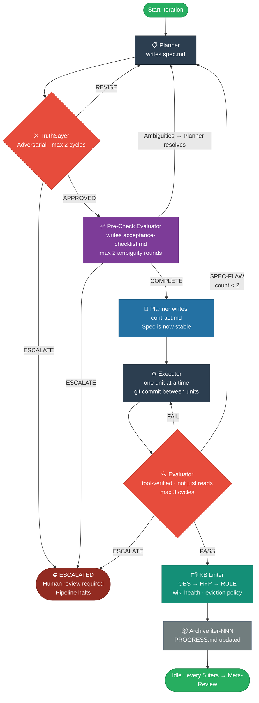
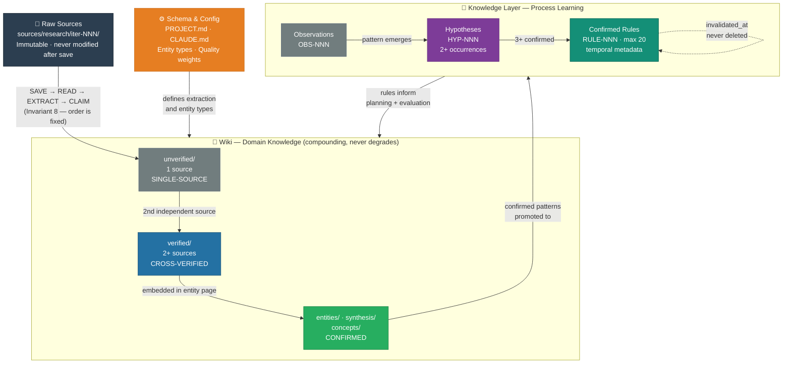

# KB-Orchestrator-Core

**A production-validated blueprint for LLM-assisted projects that don't hallucinate, drift, or forget.**

[](INDEX.md)
[](CHANGELOG.md)
[](https://claude.ai/code)
[](suggestions/pending.md)
[](#research-foundation)

> **v3.0 Phase 6b — soak in progress.** Restructure complete: Layer-2 (`00-overview/` … `80-status/`) is canonical; `SYSTEM-BLUEPRINT.md` is now a compiled view regenerated from Layer-2 by `tools/build-blueprint.sh`. Runtime ingest entry is `INDEX.md` (Layer-3) + the role-specific bundle in `bundles/`. Agents load ~3.5k tokens steady-state vs. ~70k from the original monolith. See `CHANGELOG.md` Phase 6a / 6b entries and `adoption-guides/phase-6b-soak.md` for the soak gate.

---

## The Problem

Every LLM-assisted project hits the same wall:

| Failure mode | What it looks like |
|---|---|
| **Hallucination laundering** | Unverified claims get cited, promoted to "confirmed," and built on |
| **Sycophancy collapse** | Agents praise each other's output instead of challenging it |
| **Context amnesia** | Insight from iteration 3 is gone by iteration 8 |
| **Spec drift** | What gets built diverges from what was agreed |
| **Gap blindness** | Unverified assumptions stay invisible until they break production |
| **Fact corruption** | New facts silently overwrite old ones, no trace left |
| **Reward hacking** | Agent satisfies the evaluator's surface checks without solving the real problem |

Most teams patch these one at a time. This system eliminates all seven structurally.

---

## What This Is

**KB-Orchestrator-Core** is a canonical system blueprint for running LLM agents on real projects — research, commercial, or hybrid. It defines:

- **An adversarial pipeline** where the agent that produces output is structurally separated from the agent that evaluates it
- **A self-learning knowledge base** where observations promote to hypotheses promote to confirmed rules — compounding across every iteration
- **A wiki layer** for domain knowledge that never degrades, only gets richer
- **Temporal fact management** — facts are invalidated, never silently overwritten
- **Claude Code harness integration** — hooks, MCP servers, permission modes, slash commands

This is not a prompt template. It is an architecture.

> **Point any agent at `INDEX.md` (or the role-specific bundle in `bundles/`). The agent loads ~3.5k tokens of role context and adopts applicable components based on project state, type, and scale.**

---

## Architecture

### Agent Pipeline


```mermaid
flowchart TD
    START([Start Iteration]):::green --> PLAN

    PLAN["📋 Planner\nwrites spec.md"]:::dark
    PLAN --> AUDIT

    AUDIT{"⚔️ TruthSayer\nAdversarial · max 2 cycles"}:::red
    AUDIT -- REVISE --> PLAN
    AUDIT -- APPROVED --> PRECHECK
    AUDIT -- ESCALATE --> ESC

    PRECHECK["✅ Pre-Check Evaluator\nwrites acceptance-checklist.md\nmax 2 ambiguity rounds"]:::purple
    PRECHECK -- "Ambiguities → Planner resolves" --> PLAN
    PRECHECK -- COMPLETE --> CONTRACT
    PRECHECK -- ESCALATE --> ESC

    CONTRACT["📄 Planner writes contract.md\nSpec is now stable"]:::blue
    CONTRACT --> EXEC

    EXEC["⚙️ Executor\none unit at a time\ngit commit between units"]:::dark
    EXEC --> EVAL

    EVAL{"🔍 Evaluator\ntool-verified · not just reads\nmax 3 cycles"}:::red
    EVAL -- FAIL --> EXEC
    EVAL -- "SPEC-FLAW\ncount < 2" --> PLAN
    EVAL -- ESCALATE --> ESC
    EVAL -- PASS --> KBLINT

    KBLINT["🗂️ KB Linter\nOBS → HYP → RULE\nwiki health · eviction policy"]:::teal
    KBLINT --> ARCHIVE

    ARCHIVE["📦 Archive iter-NNN\nPROGRESS.md updated"]:::grey
    ARCHIVE --> DONE([Idle · every 5 iters → Meta-Review]):::green

    ESC(["⛔ ESCALATED\nHuman review required\nPipeline halts"]):::escalate

    classDef green  fill:#27ae60,color:#fff,stroke:#1e8449
    classDef red    fill:#e74c3c,color:#fff,stroke:#c0392b
    classDef escalate fill:#922b21,color:#fff,stroke:#7b241c
    classDef blue   fill:#2471a3,color:#fff,stroke:#1a5276
    classDef purple fill:#7d3c98,color:#fff,stroke:#6c3483
    classDef teal   fill:#148f77,color:#fff,stroke:#0e6655
    classDef dark   fill:#2c3e50,color:#fff,stroke:#1a252f
    classDef grey   fill:#717d7e,color:#fff,stroke:#5d6d7e
```

### Knowledge Architecture


```mermaid
flowchart TD
    CFG["⚙️ Schema & Config\nPROJECT.md · CLAUDE.md\nEntity types · Quality weights"]:::config

    subgraph WIKI["📖 Wiki — Domain Knowledge  (compounding, never degrades)"]
        direction LR
        UV["unverified/\n1 source\nSINGLE-SOURCE"]:::unverified
        V["verified/\n2+ sources\nCROSS-VERIFIED"]:::verified
        ENT["entities/ · synthesis/\nconcepts/\nCONFIRMED"]:::entity
        UV -- "2nd independent source" --> V
        V -- "embedded in entity page" --> ENT
    end

    SRC["📁 Raw Sources\nsources/research/iter-NNN/\nImmutable · never modified after save"]:::sources

    subgraph KL["🧠 Knowledge Layer — Process Learning"]
        direction LR
        OBS["Observations\nOBS-NNN"]:::obs
        HYP["Hypotheses\nHYP-NNN\n2+ occurrences"]:::hyp
        RUL["Confirmed Rules\nRULE-NNN · max 20\ntemporal metadata"]:::rule
        OBS -- "pattern emerges" --> HYP
        HYP -- "3+ confirmed" --> RUL
        RUL -. "invalidated_at\nnever deleted" .-> RUL
    end

    SRC -- "SAVE → READ → EXTRACT → CLAIM\n(Invariant 8 — order is fixed)" --> UV
    CFG -- "defines extraction\nand entity types" --> WIKI
    ENT -- "confirmed patterns\npromoted to" --> KL
    KL -- "rules inform\nplanning + evaluation" --> WIKI

    classDef config   fill:#e67e22,color:#fff,stroke:#ca6f1e
    classDef sources  fill:#2c3e50,color:#fff,stroke:#1a252f
    classDef unverified fill:#717d7e,color:#fff,stroke:#5d6d7e
    classDef verified fill:#2471a3,color:#fff,stroke:#1a5276
    classDef entity   fill:#27ae60,color:#fff,stroke:#1e8449
    classDef obs      fill:#717d7e,color:#fff,stroke:#5d6d7e
    classDef hyp      fill:#7d3c98,color:#fff,stroke:#6c3483
    classDef rule     fill:#148f77,color:#fff,stroke:#0e6655
```

**Three non-negotiable design principles:**

1. **Generator ≠ Evaluator** — Structural separation, not instructional. One agent cannot both produce and judge its own output.
2. **Sprint contract before execution** — The Evaluator signs acceptance criteria *before* the Executor writes a single line. Prevents non-convergence.
3. **Temporal facts, never overwrites** — Old facts are marked `invalidated_at`, not deleted. The KB is an audit trail.

---

## Who This Is For

- **AI engineers** building multi-agent systems and tired of agents that hallucinate or drift
- **Developers using Claude Code** who want a structured harness, not just prompts
- **Research teams** compiling knowledge bases that need to stay accurate over hundreds of sources
- **Commercial builders** who need LLM output they can actually ship

You don't need all of it. The [Minimum Viable Adoption](#minimum-viable-adoption) section is three elements that eliminate 80% of the failure modes.

---

## What's Included

```
KB-Orchestrator-Core/
├── INDEX.md                  ← Layer-3 runtime entrypoint — agents start here
├── SYSTEM-BLUEPRINT.md       ← Compiled view (regenerated from Layer-2 by tools/build-blueprint.sh)
├── 00-overview/              ← Layer-2: invariants, philosophy, design principles, glossary, system map
├── 10-pipeline/              ← Layer-2: state machine, lifecycle, file contracts, quality gates, escalation
├── 20-roles/                 ← Layer-2: 11 role contracts (orchestrator..apply-meta)
├── 30-knowledge/             ← Layer-2: wiki architecture, KB, temporal facts, three-tier memory
├── 40-runtime/               ← Layer-2: dispatch shim, ledger, bootstrap, harness decay, Claude Code
├── 50-adapters/              ← Layer-2: claude-orchestrator, claude-native, codex-bridge, capability matrix
├── 60-schemas/               ← Layer-2: 10 schema specs for the §25 dispatch shim Step 8 gate
├── 80-status/                ← Layer-2: shipped-vs-planned registry
├── bundles/                  ← Layer-3: 13 role-specific bundle manifests (~3.5k tokens steady-state)
├── agents.config.yaml        ← Service-agnostic agent registry (schema_version: 2)
├── commands/                 ← 12 slash commands: _delegate (shim) + 11 role-bearing
├── adoption-guides/          ← v2.9 INVARIANT 10, Phase 6b soak, external orchestrator directive, codex-bridge adapter wiring (sibling claude-codex-orchestration)
├── tools/                    ← build-blueprint, build-bundle, verify-frontmatter, verify-cross-refs
├── pipeline/                 ← verification-ledger.jsonl + soak-state.json
├── .github/workflows/        ← CI drift gate
├── CHANGELOG.md              ← Full version history with audit findings
├── CLAUDE.md                 ← How this repo operates and evolves
├── audits/                   ← Independent adversarial audit reports
├── research/sources/         ← Karpathy LLM wiki deep research + source library
└── suggestions/
    └── pending.md            ← Adoption-project suggestions tracker
```

**What the blueprint covers:**

| Section | Topic |
|---|---|
| 1–2 | Philosophy + Non-Negotiable Invariants |
| 3–5 | Architecture, Directory Structure, Config Files |
| 6–9 | Agent Roles, Pipeline Lifecycle, Slash Commands |
| 10–14 | KB Architecture (Karpathy pattern), Wiki Layer, Knowledge Layer, Temporal Facts, Provenance |
| 15–19 | Quality Criteria, Escalation, Token Budget, Reward Hacking, Trust Model |
| 20–22 | Selective Retrieval (3-tier), Meta-Review, Harness Decay |
| 23 | Adoption Guide (new and mid-project) |
| 24 | Claude Code Harness Integration (hooks, MCP, permissions, CLAUDE.md hierarchy) |
| 25 | **External Agent Delegation Protocol** (v2.8) — service-agnostic adapter/agent/role architecture; Codex bridge integration; verification ledger |

---

## Quick Start

### Option A — Drop the system into an existing project

```bash
# Copy the runtime entry, layer-2 sources, bundles, agent registry, commands,
# and tools. The compiled monolith comes along for backwards compatibility.
cp INDEX.md SYSTEM-BLUEPRINT.md agents.config.yaml CHANGELOG.md your-project/
cp -r 00-overview 10-pipeline 20-roles 30-knowledge 40-runtime 50-adapters 60-schemas 80-status your-project/
cp -r bundles commands adoption-guides tools your-project/
mkdir -p your-project/.github/workflows && cp .github/workflows/ci.yml your-project/.github/workflows/

# Register the slash commands so Claude Code can invoke them. The copy above
# lands the command SPECS under commands/; Claude Code only exposes commands
# placed in .claude/commands/. Symlink (tracks upstream) or copy:
mkdir -p your-project/.claude/commands && \
  ln -s ../../commands/*.md your-project/.claude/commands/ 2>/dev/null || \
  cp commands/*.md your-project/.claude/commands/
```

> **Why this step matters:** without it, `/wiki-ingest`, `/wiki-query`, `/plan`, and the other role-bearing commands are documented contracts but not invokable — the harness never sees them. This is the single most common adoption miss.

Then point Claude Code at INDEX.md:
```
Read INDEX.md and scaffold this project as a commercial project.
Project type: commercial. Primary objective: [your objective].
Run /onboard (or your equivalent) to generate the full directory structure.
```

### Option B — Fork this repo as your reference system

Fork → rename → update `CLAUDE.md` with your project's specifics → adapt blueprint sections to your domain.

### Option C — External orchestrator (foreign harness)

If you are *not* using Claude Code as your orchestrator (you have a Claude Agent SDK app, a Codex-driven harness, an OpenAI-compatible HTTP runner, an MCP host, or a custom CLI), follow `adoption-guides/external-orchestrator-directive.md` — it ships a drop-in **Directive** paragraph and a loadable **Bootstrap Prompt** plus per-adapter wiring (probe schema, INV 10 enforcement mode, dispatch output shape) for each named harness.

#### Vendoring for external orchestrators

Read-only mirror is sufficient — adopters never push back. Sparse-checkout (git ≥ 2.25):

```bash
git clone --filter=blob:none --no-checkout <KB-Orchestrator-Core-url> kb-orc
cd kb-orc
git sparse-checkout init --cone
git sparse-checkout set INDEX.md bundles 00-overview 10-pipeline 20-roles \
  30-knowledge 40-runtime 50-adapters 60-schemas 80-status agents.config.yaml \
  commands tools pipeline adoption-guides
git checkout ed5e08f    # current pin (Phase 6a, pre-v3.0.0); swap to v3.0.0 once tagged 2026-05-13 — see directive guide § "Pinning"
```

Submodule alternative (upstream sync without copying):

```bash
git submodule add <KB-Orchestrator-Core-url> vendor/kb-orc
git -C vendor/kb-orc checkout ed5e08f    # swap to v3.0.0 once tagged
```

#### Post-vendoring smoke test

Run, in order, against the vendored copy:

1. `tools/verify-frontmatter.sh --strict` — exits 0; confirms Layer-2 frontmatter intact after copy.
2. `tools/verify-cross-refs.sh` — exits 0; confirms `depends_on` / `related` references resolve.
3. `tools/build-bundle.sh --check` — exits 0; confirms bundles match Layer-2 frontmatter (no drift).
4. Initialise `pipeline/verification-ledger.jsonl` as an empty file. Initialise `PROGRESS.md` with `pipeline_state: idle`.
5. **Register the commands.** Confirm the role-bearing command specs are exposed to the harness as invokable slash commands — for Claude Code, that means present under `.claude/commands/` (symlink or copy of the vendored `commands/*.md`), not only under the vendored `commands/` mirror. Type `/wiki-ingest` and `/plan`; if the harness does not list them, they are documented but not wired. (Vendoring a submodule under `vendor/kb-orc/commands/` mirrors the **specs**; it does not register slash commands.)
6. Dry first iteration: `/plan` → observe the dispatch envelope at Step 4, the DISPATCH ledger row inside Step 4, the CONSUME ledger row inside Step 10. If all three appear with the correct schema (per `60-schemas/verification-ledger.jsonl.md`), the wiring is sound.
7. Attempt a state-mutating tool call without first emitting the four-fact INV 10 block. The harness MUST reject it. If it does not, INV 10 enforcement is not wired and the adoption is incomplete — see `adoption-guides/v2.9-invariant-10.md`.

### Adoption guides — when to read which

| Guide | Read when |
|---|---|
| [`adoption-guides/quickstart-adopt-and-bridge.md`](adoption-guides/quickstart-adopt-and-bridge.md) | You want a single drop-in prompt to hand another agent to adopt the framework AND wire the Claude–Codex bridge in one pass. Points at the deeper guides for detail. |
| [`adoption-guides/external-orchestrator-directive.md`](adoption-guides/external-orchestrator-directive.md) | You are wiring a non-Claude-Code orchestrator (Claude Agent SDK, Codex-driven, OpenAI-compatible, MCP-native, custom) to operate inside the KB-Orchestrator-Core workflow. Drop-in Directive + Bootstrap Prompt + per-adapter wiring. |
| [`adoption-guides/codex-bridge-adapter.md`](adoption-guides/codex-bridge-adapter.md) | You want to bind Codex as an executor in your KB-Orchestrator-Core deployment (codex-audit / codex-eval / codex-implement). Names sibling project `claude-codex-orchestration` as canonical implementation; install paths, INV 10 enforcement, protocol probe + degradation. |
| [`adoption-guides/v2.9-invariant-10.md`](adoption-guides/v2.9-invariant-10.md) | You need to wire INVARIANT 10 (pre-action fact presentation) enforcement in your harness. Per-runtime instructions. |
| [`adoption-guides/static-regeneration-gate.md`](adoption-guides/static-regeneration-gate.md) | You are demoting `SYSTEM-BLUEPRINT.md` to a compiled view, or maintaining the standing gate that keeps it reproducible. The v3.0 replacement for the retired soak: static load-surface proof + paragraph-level coverage + exact-reproducibility CI. |
| [`adoption-guides/phase-6b-soak.md`](adoption-guides/phase-6b-soak.md) | **RETIRED (v3.0)** — historical only. The 5-iteration soak assumed live pipeline traffic a quiescent owner repo never produces; superseded by `static-regeneration-gate.md`. |

---

## Minimum Viable Adoption

If full adoption isn't feasible, these three elements eliminate 80% of the failure modes:

1. **File-based iteration state** — `iterations/current/` with `spec.md` + `eval-report.md`. Prevents drift, enables review.
2. **Generator ≠ Evaluator** — Even manually: review your own spec from an adversarial lens before executing.
3. **Claim confidence tracking** — Inline citations + `unverified/` folder. Prevents hallucination laundering.

---

## Research Foundation

The blueprint synthesises validated findings from:

| Source | Contribution |
|---|---|
| **Karpathy** — LLM Wiki / Knowledge Base Architecture | Raw/+wiki/ two-layer pattern, query compounding, ~100-source scale threshold |
| **Anthropic Engineering** (March 2026) | Sprint contract pattern, live-tool evaluators as qualitative best practice, harness assumption decay |
| **Zep / Graphiti** (arXiv:2501.13956) | Bi-temporal knowledge graph, four-timestamp model |
| **Shopify Engineering** (2025) | Reward hacking taxonomy |
| **Google DeepMind** (arXiv:2603.04474) | Error cascade amplification in sequential pipelines — cascade breaker design |
| **OWASP LLM Top 10** (2025) | Prompt injection (LLM01), vector weaknesses (LLM08) |
| **Liu et al.** (arXiv:2502.14282) | Hierarchical agent improvement benchmarks |

Full source library: [`research/sources/karpathy-llm-wiki-deep-research.md`](research/sources/karpathy-llm-wiki-deep-research.md)

---

## Claude Code Integration

Section 24 of the blueprint covers Claude Code-native integration:

- **Hooks** — `PreToolUse` hook that enforces source immutability at the harness level (not just instructionally)
- **Permission modes** — `plan` for auditing, `acceptEdits` for execution, `auto` for unattended `./iterate.sh` runs
- **Folder-specific CLAUDE.md** — wiki/ and knowledge/ get their own scoped instruction files
- **MCP servers** — `memory` + `playwright` required for all projects; recommendation table by project type
- **MCP memory protocol** — cross-project semantic storage with tagging schema and deprecation lifecycle

---

## How to Contribute

The system improves through validated lessons from adopted projects — not speculation.

**To suggest a blueprint change:**
1. Run the pipeline on a real project
2. Document the friction point, what you observed, and which section it affects
3. File a suggestion in `suggestions/pending.md` format (see the template in that file)
4. Open a PR — suggestions backed by production observations are prioritised

**What gets accepted:**
- Fixes to genuine architectural gaps (like the contract.md sequencing bug in v2.5)
- Clarifications grounded in real misapplication (like the Hypothesis field in v2.5)
- Protocol additions confirmed across 2+ independent projects

**What doesn't get accepted:**
- Speculative additions with no production grounding
- Prompt templates (this is an architecture, not a prompt library)
- Changes that weaken the Generator ≠ Evaluator invariant

---

## Version History

| Version | Highlights |
|---|---|
| **v2.5** | Adoption-validated fixes: contract.md sequencing bug (CRITICAL), pipeline diagram contradiction, `pre-check-complete` state, commercial executor type-check + multi-tenancy gate |
| **v2.4** | Claude Code harness integration: hooks, permission modes, folder CLAUDE.md, MCP servers, memory protocol |
| **v2.3** | Karpathy wiki pattern: index format, delta tracking, query compounding, source manifest, coverage indicators |
| **v2.1** | Audit-driven: bi-temporal model upgrade, SPEC-FLAW route, pipeline.log.jsonl schema, semantic injection defense |
| **v2.0** | Pre-check Evaluator, temporal fact management, reward hacking detection, three-tier memory model |

Full history: [`CHANGELOG.md`](CHANGELOG.md)

---

## License

MIT — use freely, adapt for your projects, attribution appreciated but not required.

---

*Built and maintained by [KB-Orchestrator-Core](CLAUDE.md) — a Claude Code instance acting as system owner.*
